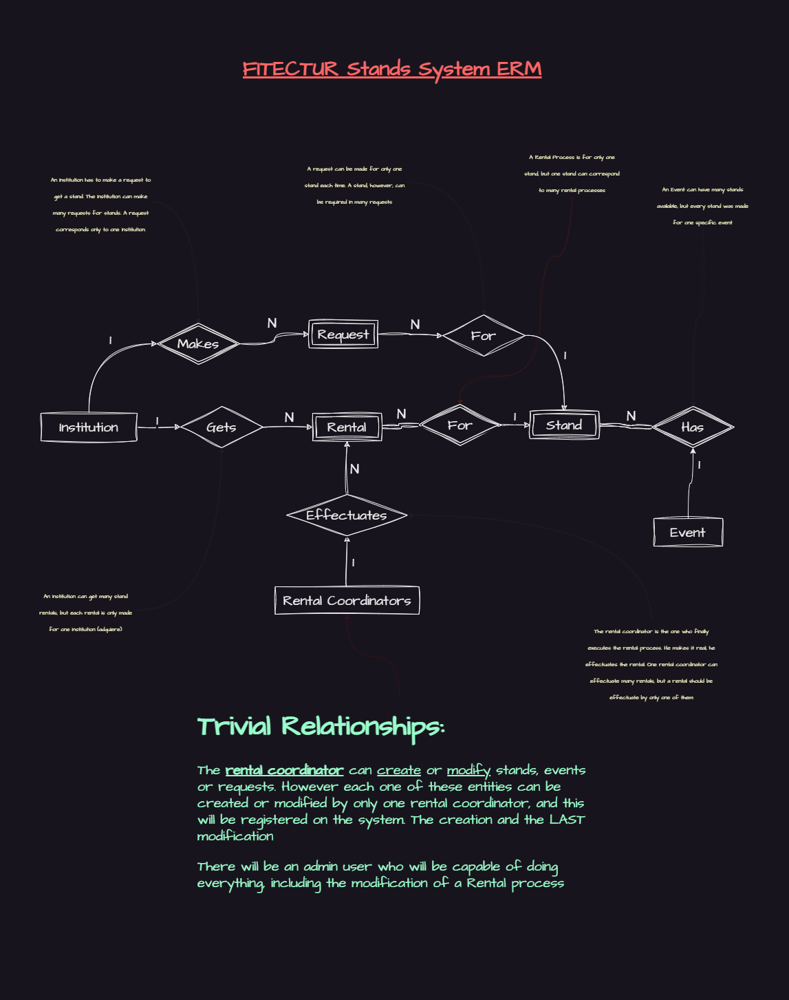

## Stands System

This is a basic stands system initially made for the FITECTUR's expos. It helps on the rental process of any expo stands. 

### Basic ERD Diagram
The database ERD of this project looks like this in its simplified way:

Some changes will be made to the database, but the basics remains the same

### Relationships Diagram
To facilitate the understanding of this system we used the DBML language to diagram our database. This diagram can be found [here](https://dbdiagram.io/d/649e203702bd1c4a5e4758a7).
<iframe width="560" height="315" src='https://dbdiagram.io/embed/649e203702bd1c4a5e4758a7'> </iframe>

### Tech stack
Since our team knowledge is limited so far we've decided to use the following tooling for this project, all around PHP and Laravel:

* PHP 8.1+
* Laravel 10+
* Blade
* Breeze
* Tailwind
* Flowbite
* Spatie Laravel Permissions

We'll eventually evolve to use antoher technologies on top of those before listed:

* Livewire
* Jetstream

### To contribute
We'll be using the most simple github workflow explained on [this video](https://youtu.be/Uszj_k0DGsg)

Even though the Jucux team has full access to this repository it's recommended that they and all the other contributors use the pull request to implement changes to the project. Me, [C-ArenA](C-ArenA), as the repo admin will be responsible for accepting or rejecting those changes.

You can still create issues to help us.
